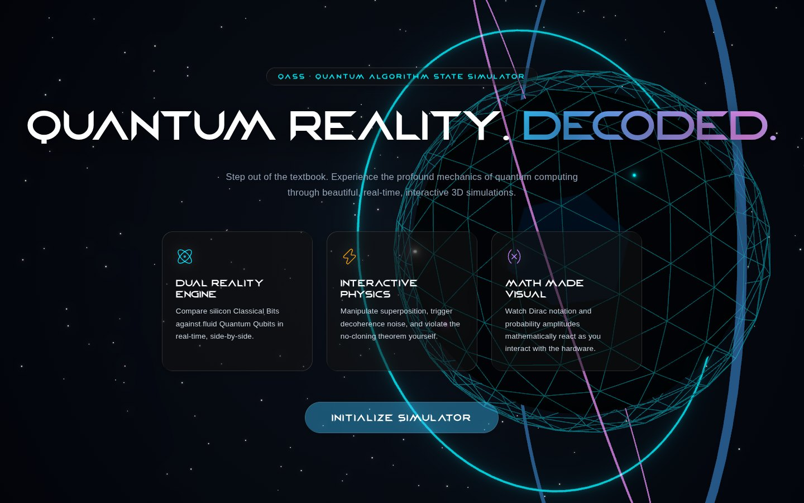
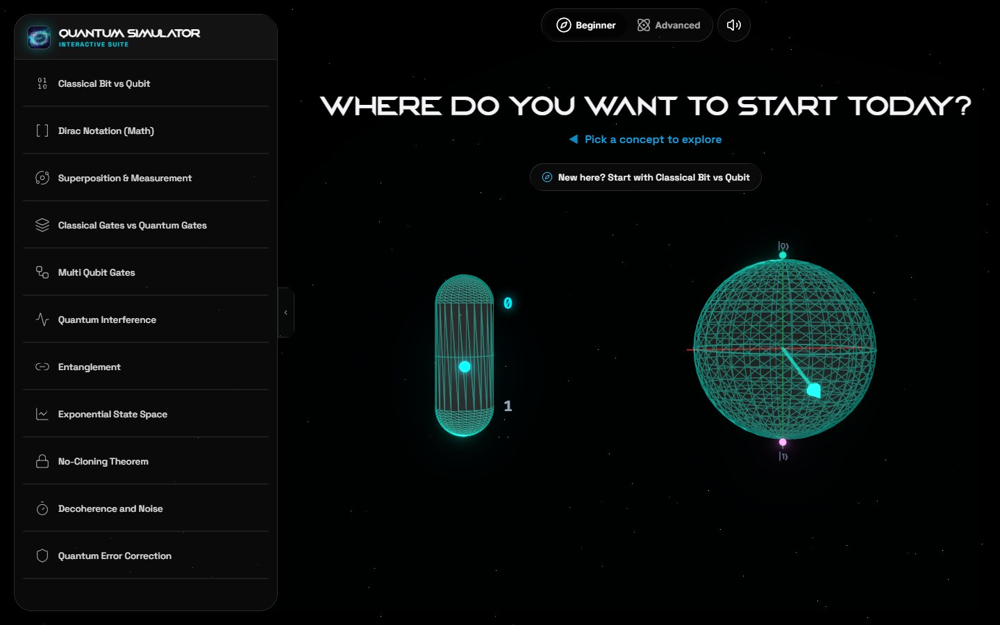
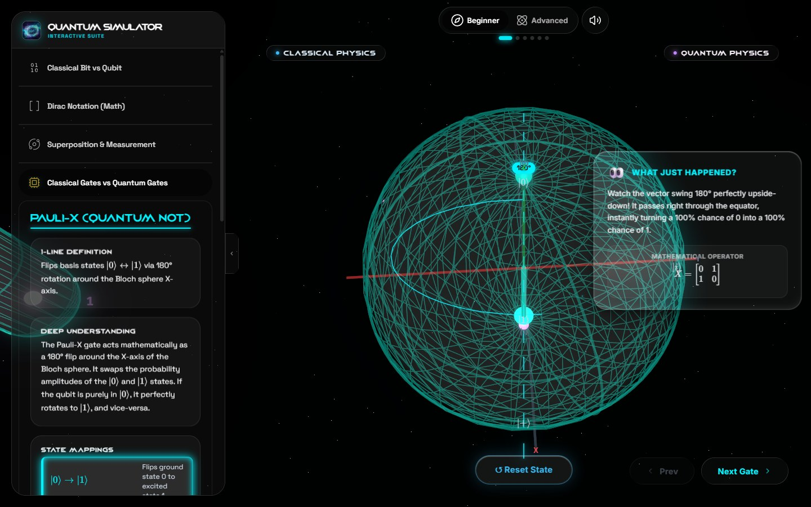
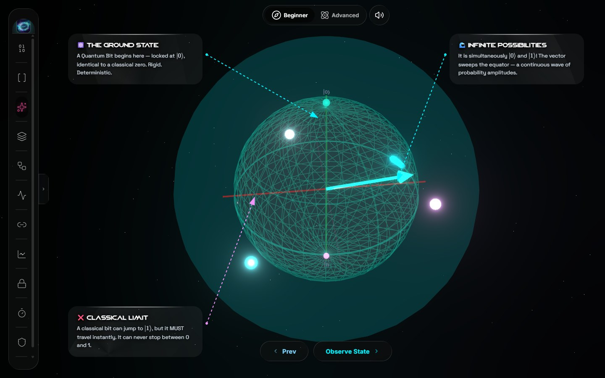
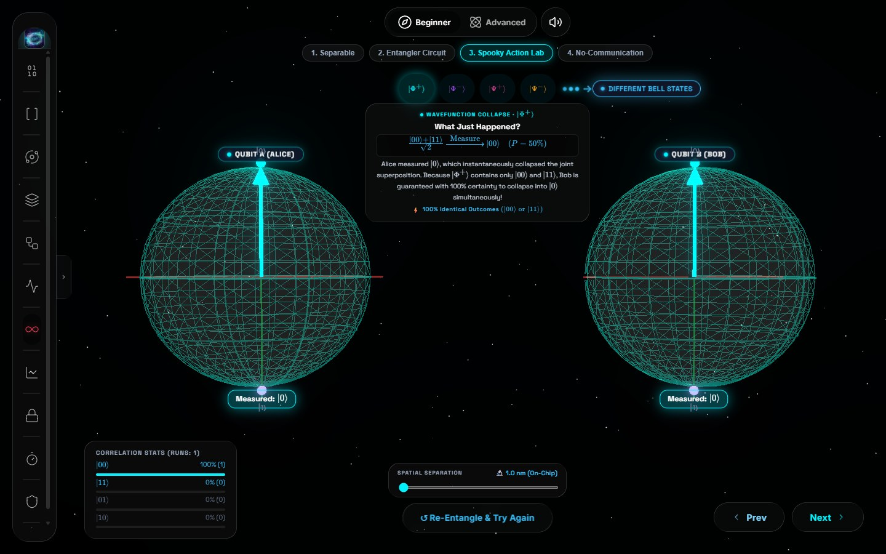
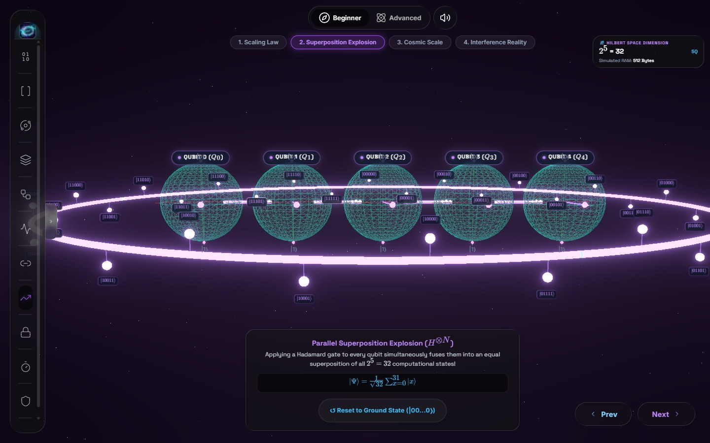
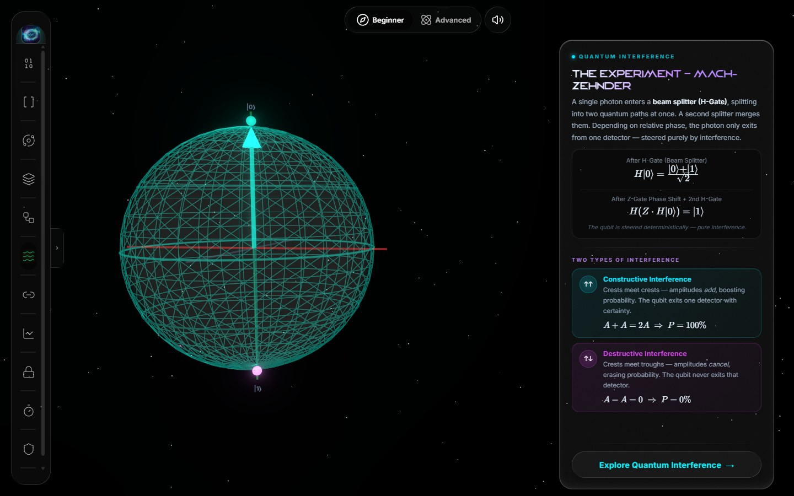

# QASS

**Quantum Reality. Decoded.** QASS (Quantum Algorithm State Simulator) is an interactive 3D quantum computing simulator that teaches the core ideas of quantum computing by letting you play with them, instead of reading about them.

Eleven guided modules take you from the difference between a bit and a qubit, through gates, interference and entanglement, up to decoherence and error correction. Every concept is a live, real-time scene: you rotate Bloch spheres, fire gates, collapse wavefunctions and watch the math update as you do it.

**Live demo:** https://qass.vercel.app



## Features

- **11 interactive modules**, each with a hands-on 3D scene, step-by-step guidance, plain-language analogies, a "common misconception" callout and KaTeX-rendered math.
- **Dual Reality engine.** Classical bits and qubits side by side, so you can see exactly what quantum adds.
- **Real quantum math.** Gate matrices, Bell states, measurement probabilities and state vectors are computed from the actual linear algebra and shown on screen.
- **A circuit diagram** for every module, one click away in the sidebar.
- **Synthesized soundscapes.** Every module has its own audio, generated live with the Web Audio API (no sound files), with a single mute control.
- **Liquid Glass interface.** The sidebar, top bar and buttons are real glass lenses that bend and reflect the scene behind them (details below), with spring-driven motion and reduced-motion / reduced-transparency support.



## The modules

| # | Module | What you do |
|---|--------|-------------|
| 1 | **Classical Bit vs Qubit** | Compare a rigid classical bit with a continuous Bloch-sphere state. |
| 2 | **Dirac Notation** | Step through kets, bras, amplitudes and the Born rule on a live state vector. |
| 3 | **Superposition & Measurement** | Apply a Hadamard, watch the vector sweep the equator, then collapse it. |
| 4 | **Classical vs Quantum Gates** | Apply Pauli-X/Y/Z, Hadamard, S and T gates and watch the rotation on the sphere. |
| 5 | **Multi-Qubit Gates** | Set the inputs, then apply CNOT, SWAP, Toffoli and CZ, plus an H + CNOT Bell-state step. |
| 6 | **Quantum Interference** | Drag H and Z gates onto a Mach-Zehnder interferometer, then explore a phase sandbox. |
| 7 | **Entanglement** | Build a Bell pair, measure one qubit, and see the other collapse instantly. |
| 8 | **Exponential State Space** | Add qubits one at a time and watch the state space double (2<sup>N</sup>). |
| 9 | **No-Cloning Theorem** | Copy a classical bit, then try, and fail, to copy a qubit. |
| 10 | **Decoherence & Noise** | Inject noise into a qubit and cool it to see coherence survive. |
| 11 | **Quantum Error Correction** | Strike a qubit with a bit-flip and recover it with parity checks. |

<table>
  <tr>
    <td width="50%"><br/><sub><b>Gates:</b> applying Pauli-X, with the operator and an explanation.</sub></td>
    <td width="50%"><br/><sub><b>Superposition:</b> the vector sweeps the equator before measurement.</sub></td>
  </tr>
  <tr>
    <td width="50%"><br/><sub><b>Entanglement:</b> measuring Alice collapses Bob, with live correlation stats.</sub></td>
    <td width="50%"><br/><sub><b>Exponential state space:</b> five qubits, 32 basis states.</sub></td>
  </tr>
</table>



## Getting started

You need a recent [Node.js](https://nodejs.org/) LTS and a desktop browser. Chrome or Edge gives the full glass effect (see below).

```bash
git clone https://github.com/Knsravan/QASS.git
cd QASS
npm install
npm start
```

The app opens at <http://localhost:3000>. Other scripts:

| Command | What it does |
|---------|--------------|
| `npm run build` | Optimized production build in `build/` |
| `npm run preview` | Serves the production build locally |
| `npm test` | Runs the unit tests (Vitest) |
| `npm run lint` | Lints the source (ESLint, fails on any warning) |

The simulator is designed for desktop and tablet screens. On narrow windows (under 768 px) it shows a message asking you to use a larger screen.

## Built with

- [React 19](https://react.dev/) and [Vite](https://vite.dev/)
- [three.js](https://threejs.org/) with [react-three-fiber](https://r3f.docs.pmnd.rs/), [drei](https://github.com/pmndrs/drei) and postprocessing (bloom, chromatic aberration)
- [GSAP](https://gsap.com/) and [react-spring](https://www.react-spring.dev/) for animation
- [KaTeX](https://katex.org/) for math rendering
- The Web Audio API for all sound design
- [Lucide](https://lucide.dev/) icons with [Morphicons](https://www.npmjs.com/package/morphicons) transitions

## How it is organized

| Path | What lives there |
|------|------------------|
| `src/App.jsx` | App shell: landing page, sidebar, module routing, mute and learning-mode state |
| `src/*Module.jsx`, `src/BlochSphere.jsx`, `src/QuantumGates.jsx`, ... | One file per module's 3D scene and overlay |
| `src/quantumMath.js` | State-vector, gate and measurement math |
| `src/use*Audio.js`, `src/sharedAudio.js` | Per-module sound design on one shared `AudioContext` |
| `src/LiquidGlass.js`, `src/glassLens.js`, `src/GlassNavBar.jsx` | The Liquid Glass material, its lens filter and the floating tab bar |
| `src/liquid-glass/` | The Liquid Glass skill's material, used by the sidebar and the top bar |
| `scripts/generate_audio.js` | Optional: regenerates the narration clips (see below) |

### The Liquid Glass material

The sidebar (and its toggle), the top bar (the Beginner / Advanced tabs and the mute button) and the buttons are real liquid glass lenses. `src/glassLens.js` builds an SVG filter for each surface's size that runs inside `backdrop-filter`: the scene behind the glass is frosted in the middle and bent at the rim like the curved edge of a glass slab, and a fixed light from the top-left catches the rim as a reflection. Chrome does not load images inside `backdrop-filter`, so the filter makes its own displacement map from a blurred rectangle (the glass "height") with offsets and arithmetic composites. On large surfaces, only four thin rim strips run the costly steps.

`LiquidGlass.js` applies the lens to a `::before` layer of each surface. On the element itself, its drop shadow would shift Chrome's filter coordinates. Lenses are built in idle time for each surface's size and are rebuilt after a resize settles; until then the surface shows plain frost. A frame-rate guard switches every lens back to plain frost for the rest of the session if the machine can't keep up. Disabled (faded) buttons always use plain frost. Cards, tooltips and badges keep the frosted material with a lit rim. Refraction needs a Chromium-based browser; Safari and Firefox get the frosted glass without the bending.

The glass also moves like liquid (`src/glassMotion.js`, springs on CSS `scale` / `translate`):

- **Jelly press:** pressed glass squashes under your finger and wobbles back.
- **Drag stretch:** dragging while pressed pulls the glass along and stretches it; on release it springs home with the drag's momentum.
- **Reactive rim:** the light stays fixed at the top-left, but as glass moves its rim shine sloshes behind the motion and brightens with speed, and a press flashes it.
- **Droplet merge:** in the top bar, the mute circle reaches toward the Beginner / Advanced capsule on hover and melts into it when pressed.
- **Resizing:** the sidebar keeps its lens while it opens and closes, rebuilt for each new size.

All of it is off with reduced motion.

And it reacts to light (`src/glassLight.js` and the lens itself):

- **Colour split:** the lens bends red, green and blue by slightly different amounts, so the rim shows a faint rainbow fringe.
- **Light cast below:** floating glass throws a soft cyan / violet glow down and to the right, opposite the top-left light.
- **Adaptive tone:** glass with something bright in the 3D scene behind it (the landing cards, the top bar, the modules' info cards) turns lighter with dark text, then back.
- **Tilt:** on phones and tablets, tilting the device moves the rim light and the sheen (iOS asks for permission on the first tap).
- **Morphing:** tooltips and the glass cards and panels inside modules grow in like a drop of glass, and the sidebar opens and closes on a liquid spring.
- **Slow computers:** the frame-rate guard first drops only the big lenses (the sidebar, large cards); the small glass keeps bending unless it is still too slow.

Every glass surface in the app is lensed now, tooltips, info cards and labels included.

To check the glass on a real machine, open the app with `?glassdebug` in the address (for example `https://qass.vercel.app/?glassdebug`). A small readout shows the frame rate, whether the browser can bend, the slow-computer fallback state and how many glass surfaces are bending, with a button to reset the fallback.

The tint, rim and highlight come from the Liquid Glass skill in `src/liquid-glass/`, whose custom properties are prefixed `--lgs-` so they never collide with `LiquidGlass.js`'s `--lg-` ones. The mute button leans toward the mouse.

The tab bar's selection indicator is a hand-written spring (damping 0.72, stiffness 320) that stretches while it travels, can be dragged, and can be interrupted mid-flight.

### Narration clips (optional)

`public/audio` holds a set of narration clips for the Superposition and Dirac Notation modules. The app does not play them yet. `scripts/generate_audio.js` can regenerate the Superposition ones with [ElevenLabs](https://elevenlabs.io/) using your own API key:

```bash
ELEVENLABS_API_KEY=your_key node scripts/generate_audio.js
```

## Roadmap

- **Advanced mode.** The Beginner / Advanced switch is in place, but the Advanced sandbox is not built yet and currently shows a "loading" placeholder.
- Wiring the narration clips into the Superposition and Dirac modules.
- A mobile-friendly layout.

## Acknowledgements

The Liquid Glass lens and highlight follow the approach of [Kyant0/backdrop](https://github.com/Kyant0/backdrop) (Apache-2.0), and the tab bar's structure and behavior are modeled on [BitChord](https://github.com/kushagrasinghx/BitChord) (which builds on Echo Music). Both were reimplemented for the web.
